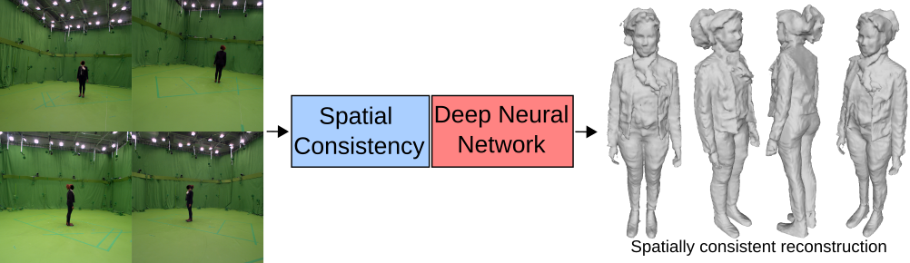
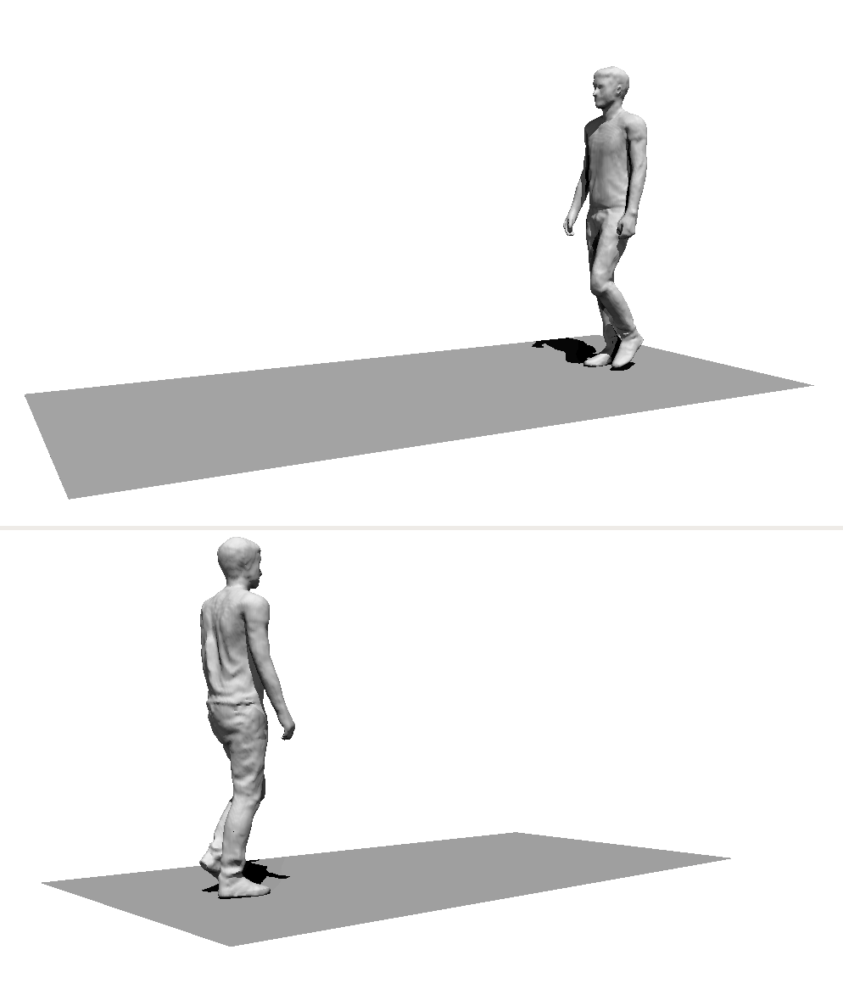

# Data-Driven 3D Reconstruction of Dressed Humans From Sparse Views

This repository is the official Pytorch implementation of the paper **Data-Driven 3D Reconstruction of Dressed Humans From Sparse Views**.
- [arXiv](https://arxiv.org/abs/2104.08013)
- [HAL](https://hal.inria.fr/view/index/docid/3448770)
- [Github](https://github.com/pzins/Data-Driven-3D-Reconstruction-of-Dressed-Humans-from-Sparse-Views)

<div align="center">
  
  
</div>

If you find this project useful for your research, please cite:

```
@inproceedings{zins2021data,
  title={Data-driven 3D reconstruction of dressed humans from sparse views},
  author={Zins, Pierre and Xu, Yuanlu and Boyer, Edmond and Wuhrer, Stefanie and Tung, Tony},
  booktitle={2021 International Conference on 3D Vision (3DV)},
  pages={494--504},
  year={2021},
  organization={IEEE}
}
```


## Requirements
```
conda create -n mvpifu python=3.7
conda activate mvpifu
conda install -c conda-forge pyembree embree=2.17.7 
pip install -r requirements.txt
```

## Dataset
We are not authorized to release the full training/test data due to the restriction of commercial scans [RenderPeople](https://renderpeople.com). 
We provide however the rendering code that we used as well as the train/test/validation split for training (see `./config/training_data/`).

## Data preparation
Run the following script to compute spherical harmonics coefficients for each subject.
```
python render/prt_utils.py -i {path_to_subject_folder}
```

Then we consider 2 cases:
- _Case 1_ : the subject is rotated in front of an orthographic or perspective camera. The subject is centered in the rendered images (512x512).
- _Case 2_ : the subject is randomly positioned in the scene and multiple perspective cameras observe the scene. The subject is not necessarily centered in the rendered images (2048x2048).

### Case 1
Run the following script with each subject to render images and masks and save camera parameters. It creates folders named `GEO`, `RENDER`, `MASK` and `PARAM`. 
> - Option '-e' allows headless rendering on a server.
> - Option '-s xxx' defines the resolution of the output images.
> - Option '-p ortho/persp' defines the type of camera used.

```
python render/render_data.py -i {path_to_subject_folder} -o {dataset_name} -e -s 512 -p ortho
```

### Case 2
1. Run the following script with each subject to render images and masks and save camera parameters. It creates folders named `GEO`, `RENDER`, `MASK` and `PARAM`. 
> - Option '-e' allows headless rendering on a server.
> - Option '-s xxx' defines the resolution of the output images.

```
python render/render_data_scene.py -i {path_to_subject_folder} -o {dataset_name} -e -s 2048
```

2. Run the follwing script on the dataset generated at the previous step to prepare data for training.
```
python utils/process_training_data_scene.py -i {dataset_path} -n {numer_of_workers}
```


## Training
Configuration is possible through configuration files and command line arguments (see `./configs`, `./utils/config.py` and `./utils/options.py`)

```
python train.py --dataroot {dataset_path} --config {configuration_file} --name exp_1
```

Training metrics can be visualized in tensorboard:
```
tensorboard --logdir ./logs/
```


## Inference
Again, we differentiate two cases:
 - Case 1: the images are already cropped and the subject is centered.
 - Case 2: the cameras see the whole scene and the subject is somewhere in it.

### Case 1
Test data should respect the following structure:
```
test_data_folder
│
└───rp_{subject-name}_posed_{subject-id}
│   │   N images: {yaw}_{pitch}_00.jpg
│   │   N masks: {yaw}_{pitch}_00_mask.png
│   │   N camera parameters: {yaw}_{pitch}_00_.npy
|
└───rp_{subject-name}_posed_{subject-id}
│   │   N images: {yaw}_{pitch}_00.jpg
│   │   N masks: {yaw}_{pitch}_00_mask.png
│   │   N camera parameters: {yaw}_{pitch}_00_.npy
|
└───...
```

Run the following command to regroup data from an existing test dataset into a folder.
> Parameters should be specified directly in the python file.
```
python utils/prepare_inference_data.py
```

Run the following command to start the reconstructions.
```
python inference.py --load_checkpoint {checkpoint_path} --infer_data {test_data_folder}
```


### Case 2
1. Use Openpose to detect the human center on each image of each subject.
```
./build/examples/openpose/openpose.bin --image_dir {dataset_path}/RENDER/{subject_name}/ --write_json {dataset_path}/KEYPOINTS/{subject_name}/
```
2. Process inference data: triangulate the 3D position of the human center, define a local canonical coordinate system, create images and masks crops.
> Parameters should be specified directly in the python file.
```
pip install --no-binary :all: opencv-contrib-python  # Install cv2.sfm
python utils/process_inference_data_scene.py {subject_name}
```
3. Regroup all data required in a single folder.
> Parameters should be specified directly in the python file.
```
python utils/prepare_inference_data_scene.py
```

Run the following command to start the reconstructions.
```
python inference.py --load_checkpoint {checkpoint_path} --infer_data {test_data_folder}
```


## Acknowledgement
This repository is based on [PIFu](https://github.com/shunsukesaito/PIFu). 
We thank the authors for sharing their code.
